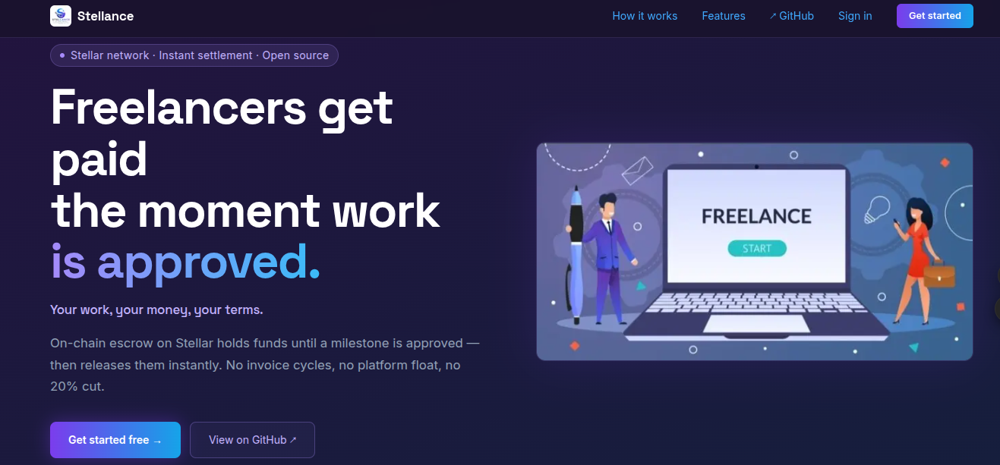
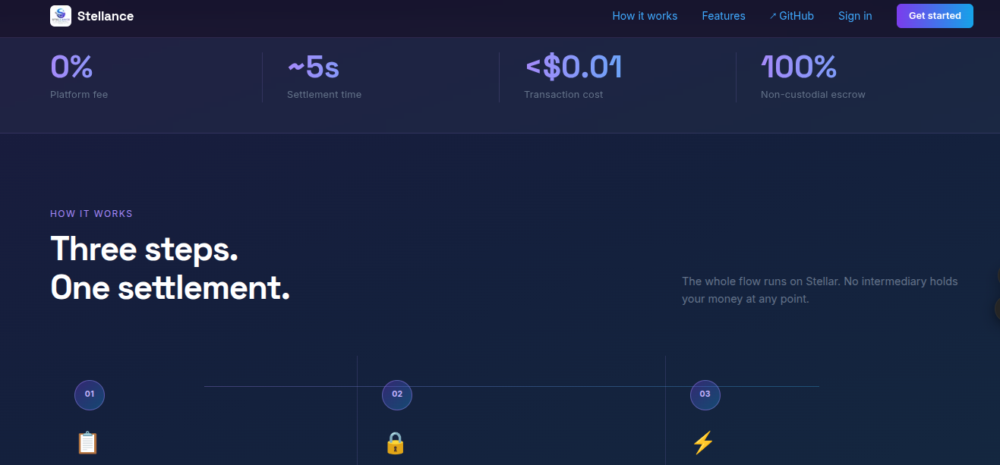
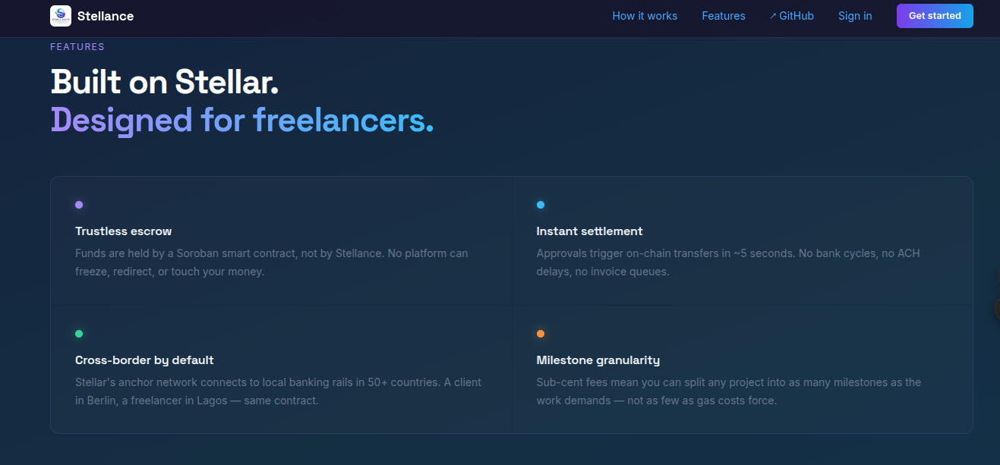
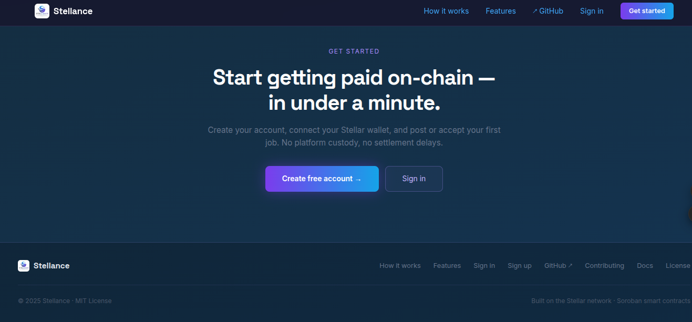

<div align="center">
  

  # Stellance

  **A Stellar-powered freelance payment marketplace for instant escrow and on-chain payouts.**

  [](https://github.com/alone-in/stellances/actions/workflows/ci.yml)
  [](LICENSE)
  [](https://stellar.org)
  [](CONTRIBUTING.md)
</div>

---

<div align="center">
  <table>
    <tr>
      <td align="center">
        
        <br /><sub><b>Landing Page</b></sub>
      </td>
      <td align="center">
        
        <br /><sub><b>Browse Jobs</b></sub>
      </td>
    </tr>
    <tr>
      <td align="center">
        
        <br /><sub><b>Payments Dashboard</b></sub>
      </td>
      <td align="center">
        
        <br /><sub><b>My Contracts</b></sub>
      </td>
    </tr>
  </table>
</div>

---

## Why Stellance Exists

The freelance economy has three problems that blockchain is actually suited to solve:

- **Custody risk** — platforms hold client funds, creating a single point of failure and requiring trust in the intermediary.
- **Settlement lag** — traditional payment rails (wire, ACH, PayPal) settle in 1–5 days, so freelancers wait days after work is approved.
- **Cross-border cost** — international payments lose 3–8% to FX and remittance fees, disproportionately hurting freelancers in emerging markets.

Stellance puts escrow logic on Soroban, Stellar's smart contract layer. Funds are held by code, not by Stellance. Payments settle in ~5 seconds. And because the payment rail is Stellar, a freelancer in Lagos and a client in Berlin share the same asset contract — no FX intermediary required.

---

## Why Stellar Specifically

> This section explains why Stellar is not interchangeable with Ethereum, Solana, or any other chain for this use case.

### 1. Built for payments, not computation

Stellar was designed from the ground up to move value, not to run general-purpose computation. That gives it properties no EVM chain has by default:

| Property | Stellar | Ethereum L1 | Solana |
|----------|---------|------------|--------|
| Finality | ~5 s | ~13 min (PoS) | ~0.4 s |
| Tx fee | ~$0.00001 | $0.50–$50+ | ~$0.00025 |
| Native multi-asset | Yes (SEP-4) | No (ERC-20 required) | No (SPL required) |
| Anchor ecosystem | Yes (SEP-24/31) | No | No |

A freelance payment platform that charges users $5–$50 per release transaction is not a product. Stellar's fee model makes per-milestone payments — including small ones like a $20 milestone — economically rational.

### 2. Soroban for trustless escrow (not multisig)

The naive approach to blockchain escrow is Stellar multisig: require N-of-M signers to move funds. This is simpler but keeps the platform as a custodian — if Stellance holds a signing key, Stellance can theoretically take the money.

Soroban contracts make the **rules code, not trust**. The Stellance escrow contract (`stellance/Contracts/src/lib.rs`) enforces:

- `fund()` — client locks tokens; the contract is the only custodian from this point
- `release_milestone(amount)` — client (or admin) releases exactly one milestone's amount; cannot overdraw; emits an on-chain event
- `release()` — full release of all remaining funds
- `refund()` — freelancer (or admin) returns funds; client cannot self-refund
- `dispute()` — either party freezes funds; blocks `release` and `refund` until resolved
- `resolve_dispute(decision, bps)` — admin-only arbitration with atomic split (e.g. 60% freelancer / 40% refund)

The split resolution is a concrete example of what Soroban enables that multisig doesn't: two transfers in a single transaction, enforced atomically by the VM, with no way for the platform to deviate. Ethereum could do this, but at 100× the cost.

### 3. Stellar anchors for real-world on/off-ramps

Stellar's [SEP-24](https://github.com/stellar/stellar-protocol/blob/master/ecosystem/sep-0024.md) anchor ecosystem connects Stellar to local banking rails in 50+ countries. Anchors issue fiat-pegged tokens (USDC, NGN, PHP stablecoins) on Stellar and handle the local bank transfer for deposit and withdrawal.

For a freelance platform this matters directly:

- A client can deposit USD to fund a contract; the anchor converts it to USDC on Stellar.
- The Stellance escrow contract holds USDC (same SEP-41 token interface as XLM).
- When the milestone is released, the freelancer can withdraw to their local bank via the same anchor or a local one.

This cross-border flow — client funds in USD → Stellar USDC → freelancer withdraws in PHP — is available today on Stellar. It doesn't exist natively on Ethereum L1 or Solana. An Ethereum-based escrow platform would need to integrate Stripe, Wise, or similar third-party payment processors for each corridor separately. Stellar handles this at the protocol level.

### 4. SEP-41 token interface: asset-agnostic escrow

The Stellance escrow contract accepts any Stellar asset that implements the SEP-41 token interface. This is not aspirational — it's built into the contract type system:

```rust
pub fn fund(
    env: Env,
    contract_id: Symbol,
    client: Address,
    freelancer: Address,
    admin: Address,
    amount: i128,
    token: Address,   // ← any SEP-41 token: XLM, USDC, or any anchor-issued asset
) -> Result<(), EscrowError>
```

The same contract handles XLM and USDC without modification. Token support is a configuration choice at the UX layer, not a contract change.

### 5. Low fees enable milestone granularity that isn't economically viable elsewhere

Ethereum's gas model creates a floor cost for on-chain actions. At $1+ per transaction, splitting a $500 contract into 10 milestones costs $10 in gas — 2% overhead before the platform takes anything.

On Stellar, 10 milestone releases cost roughly $0.0001. This means Stellance can support fine-grained milestone tracking (hourly work logs, small deliverables, weekly check-ins) without forcing clients and freelancers to batch payments to amortize gas costs. The payment granularity can match the work structure, not the fee structure.

### 6. On-chain events for verifiable payment history

Every state transition in the Stellance escrow contract emits a Soroban event. Events are stored in Horizon and queryable without running a full node. This means:

- Any payment record in the Stellance database has a corresponding immutable on-chain event.
- Freelancers can independently verify their payment history on [stellar.expert](https://stellar.expert) without trusting Stellance's database.
- Dispute evidence (when a dispute was raised, by whom) is tamper-proof.

This is a specific Stellar/Soroban capability: Ethereum events are similar, but querying them requires an archive node or a paid third-party indexer. Horizon is a free, publicly hosted indexer provided by the Stellar Development Foundation.

---

## Current Implementation Status

| Layer | What exists today | What's in active development |
|-------|------------------|------------------------------|
| **Soroban contract** | `fund`, `release_milestone`, `release`, `refund`, `dispute`, `resolve_dispute`, `get_escrow` — fully implemented, 30 tests, WASM build ✅ | Testnet deployment, backend integration wiring |
| **Backend** | Auth (JWT + refresh token rotation), Users, Jobs CRUD, Contracts + Milestones (fund XDR, milestone approve/submit, dispute, resolve, cancel), Escrow service (Stellar SDK), Prisma schema ✅ | Payments module, Freighter-signed dispute flow |
| **Frontend** | Marketing landing page, live testnet demo (Friendbot + 1 XLM payment via Horizon), payments UI (mock data) | Marketplace UI, Freighter wallet integration, contract invocation |
| **CI** | Lint, test (backend 71 tests, Rust 30 tests), WASM build | — |

### What the demo proves today

Visit `/demo`: generate a Stellar keypair, fund it via Friendbot, and submit a real XLM transaction on the Stellar testnet. This demonstrates that the payment rail works end-to-end — Horizon connectivity, transaction building, signing, and submission.

### What the contract proves

The Soroban contract (`stellance/Contracts/src/lib.rs`) implements the full escrow state machine with 20+ tests covering: partial milestone release, double-release prevention, dispute freezing, admin-only dispute resolution, atomic splits, and unauthorized-caller rejection. It compiles to WASM and is ready to deploy to testnet.

---

## How It Works

1. **Connect** — Freelancers and clients connect a Stellar wallet (Freighter).
2. **Create contract** — Clients post jobs and agree terms with freelancers.
3. **Fund escrow** — Client calls `fund()` on the Soroban contract; tokens leave their wallet and enter the contract.
4. **Deliver milestones** — Freelancer submits work; client reviews.
5. **Release payment** — Client (or admin on dispute) calls `release_milestone()`; tokens transfer to the freelancer's Stellar address in the same transaction. Settlement in ~5 seconds.

---

## Tech Stack

### Frontend
- Next.js 16, React 19, Tailwind CSS 4
- `stellar-sdk` 10.x for Horizon interaction and transaction building
- Freighter wallet integration (in development)

### Backend
- Node.js + NestJS 11
- Prisma 7 + PostgreSQL
- `@stellar/stellar-sdk` 13.x for Horizon calls and Soroban transaction building
- Modules: Auth, Users, Jobs, Contracts + Milestones, Escrow service

### Blockchain
- Stellar network + Horizon API
- Soroban smart contracts (`stellance/Contracts/`) — `soroban-sdk` 21.x

### Wallet
- Freighter browser extension for user-side transaction signing (in development)

---

## Repository Structure

```
stellances/
├── stellance/
│   ├── backend/          # NestJS API (auth, users, jobs, contracts, escrow)
│   ├── frontend/         # Next.js app (landing page, testnet demo, payments UI)
│   └── Contracts/        # Soroban escrow contract (Rust, soroban-sdk 21.x)
├── .github/
│   ├── workflows/ci.yml  # CI: lint · test · WASM build
│   └── ISSUE_TEMPLATE/   # Contributor application templates
├── docs/
│   ├── architecture.md   # Component map, layer breakdown, auth flow
│   ├── escrow-flow.md    # State machines and sequence diagrams
│   ├── api-reference.md  # API reference
│   └── local-development.md
├── CONTRIBUTING.md
├── CHANGELOG.md
└── README.md
```

---

## Getting Started

### Clone

```bash
git clone https://github.com/alone-in/stellances.git
cd stellances
```

See [docs/local-development.md](docs/local-development.md) for the full setup guide.

### Backend

```bash
cd stellance/backend
npm install
cp .env.example .env
# Set DATABASE_URL and JWT_SECRET in .env
npx prisma migrate dev
npm run start:dev
```

API: `http://localhost:3001/api` · Swagger: `http://localhost:3001/docs`

### Frontend

```bash
cd stellance/frontend
npm install
npm run dev
```

Open `http://localhost:3000`. Visit `/demo` for the live Stellar testnet demo.

### Soroban contract

```bash
cd stellance/Contracts
cargo test                                              # run all tests
cargo build --target wasm32-unknown-unknown --release  # build WASM
```

---

## Branching Strategy

- `feat/` — new features
- `fix/` — bug fixes
- `refactor/` — code cleanup
- `docs/` — documentation

Examples: `feat/freighter-integration`, `fix/milestone-release`, `docs/anchor-guide`

---

## Project Status

Active development. Current focus:

- Soroban escrow contract: complete + test-covered; testnet deployment next
- Backend: Jobs, Contracts, Milestones, and Escrow service modules complete; Payments module in development
- Frontend: Freighter wallet integration, marketplace UI, contract invocation

---

## Documentation

| Document | Description |
|----------|-------------|
| [docs/architecture.md](docs/architecture.md) | Full system architecture |
| [docs/escrow-flow.md](docs/escrow-flow.md) | Escrow, milestone, and dispute state machines |
| [docs/api-reference.md](docs/api-reference.md) | API reference |
| [docs/local-development.md](docs/local-development.md) | Local setup guide |
| [CONTRIBUTING.md](CONTRIBUTING.md) | How to contribute |

---

## Before Submitting a PR

- Ensure the app builds without errors
- Run `cargo test` in `Contracts/` if touching contract code
- Verify no existing functionality is broken
- Make UI changes responsive
- Include a clear PR description

---

## Code of Conduct

Inclusive, respectful, and constructive.  No harassment. No gatekeeping. Focus on collaboration.

---

## License

MIT License. See [LICENSE](LICENSE).

## Security

See [SECURITY.md](SECURITY.md) for the vulnerability disclosure policy.

## Changelog

See [CHANGELOG.md](CHANGELOG.md).
